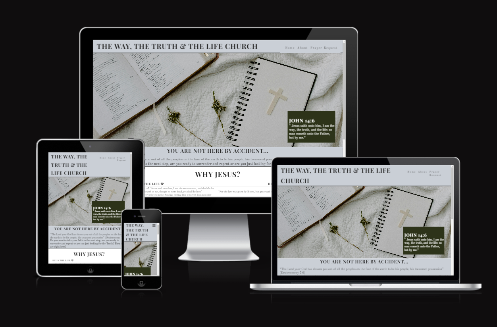
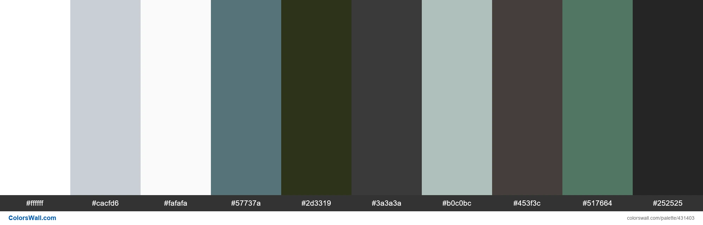
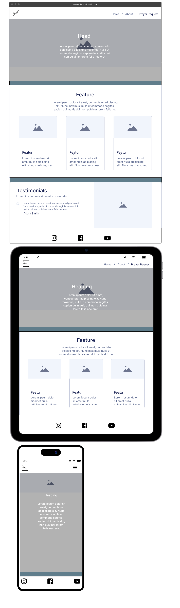
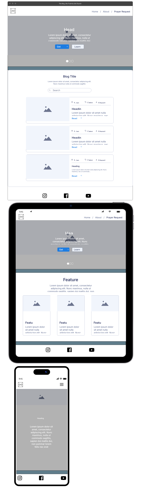
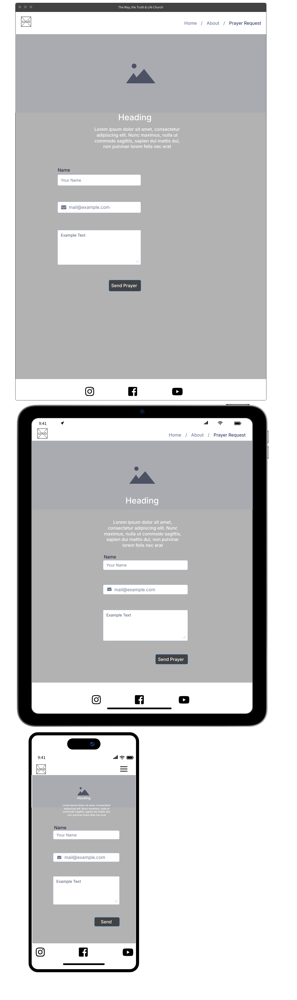
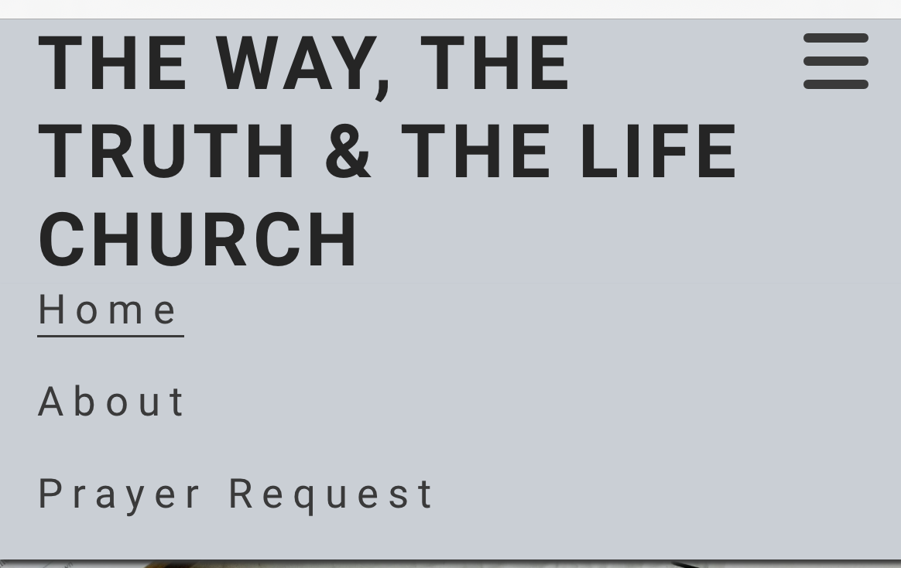
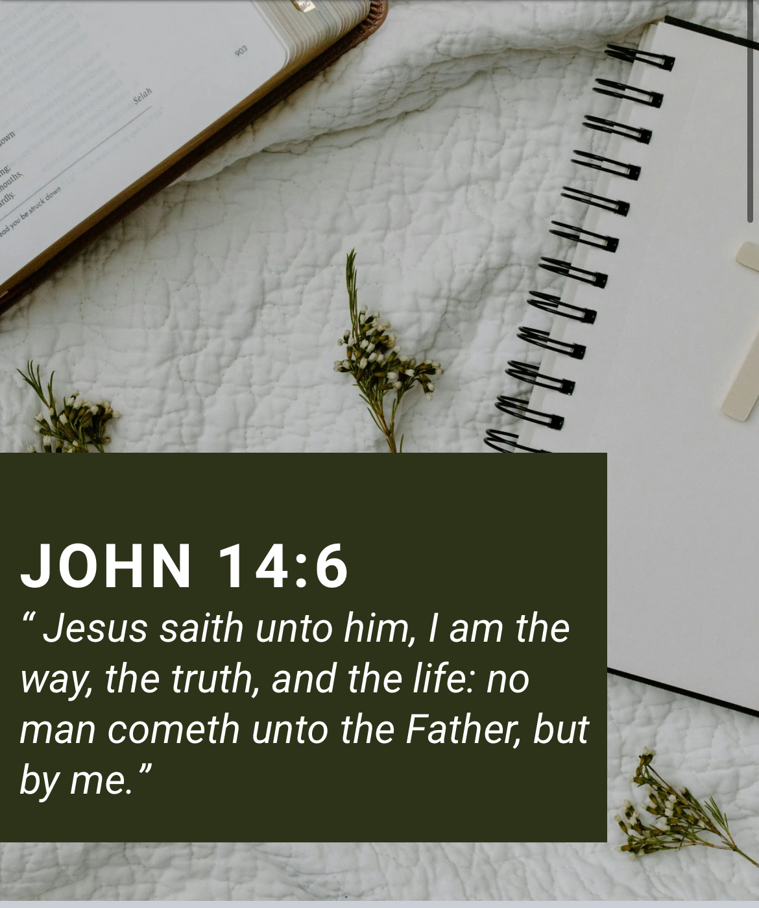
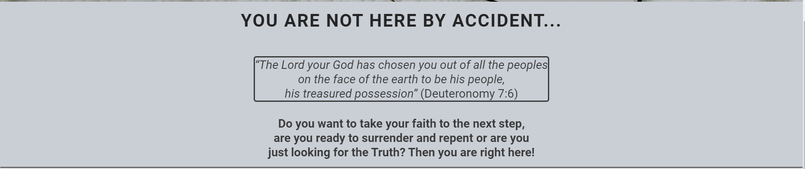
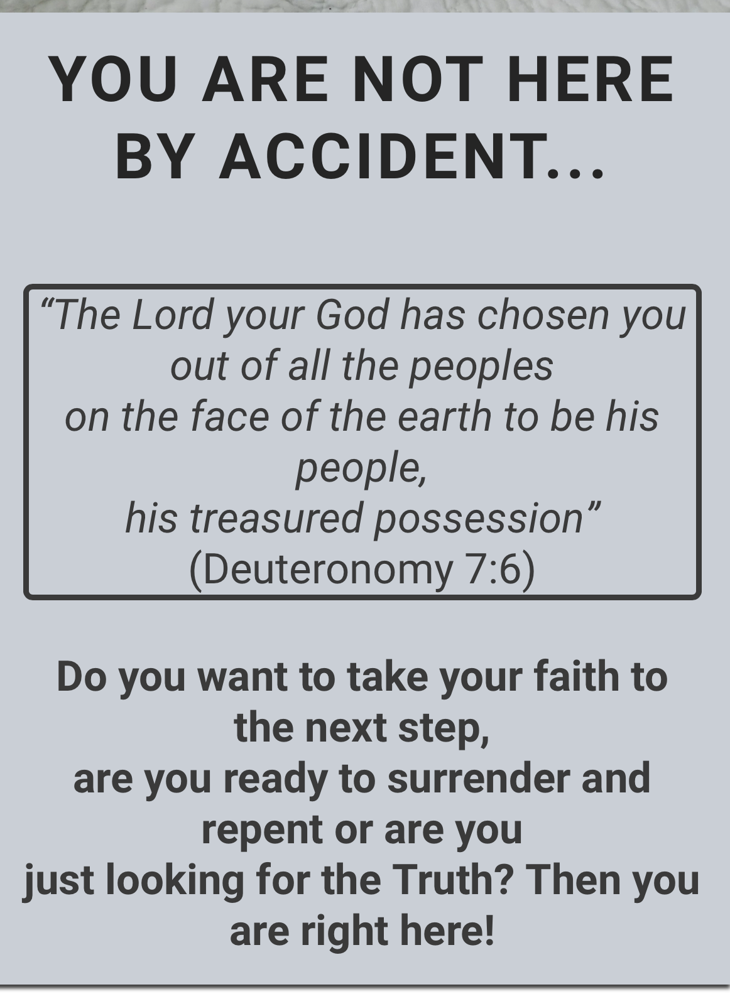

#
# The Way, the Truth & the Life Church 


## Description

Learn more about Jesus, the Word of God and get to know the Way, the Truth & the Life Church.




You can visit the live website [here!](https://tanja-franke.github.io/twtttl-church/)

## **User Experience**

This project was initiated to give the Way, the Truth & the Life Church an online presence. The website aimes to provide the visitors with information about the church and anything related to the christian faith.

### **Project Goals**

1. **Educational Resource:** To offer comprehensive knowledge about the christian faith for non-believers as well as believers.

2. **Community Engagement:** To foster a vibrant online community where believers can connect, share experiences, and engage with each other by joining online sevices or prayer meetings as well as by sending praying requests.

3. **User-Friendly Experience:** To create a visually appealing and easy-to-navigate website accessible to users of all backgrounds.

### **Target Audience**

Our target audience includes non-believers, new-believers as well as mature-believers and among them members of the church. Basically anyone interested in Christian faith and looking for a church they want to join.

## **Design**
The design was inspired by the Code Institute´s project "Love Running" and by observing other church websites. There have been a lot of ideas around the design. But lack of coding-language knowledge, needed to realize the design intended, have been affecting the actual design. The actual design is simple and easy to look at.

### **Colours**




### **Typography**

- All icons were sourced though [Font Awesome](https://fontawesome.com/)
- All fonts were sourced through [Google Fonts](https://fonts.google.com/)
- [Roboto](https://fonts.google.com/specimen/Roboto)


### **Wireframe and Prototype**

### [Mockflow](https://mockflow.com//) wireframe:

<details>
<summary> Open for initial wireframe -landing page </summary>



</details>
<summary> Open for initial wireframe -About page </summary>



</details>

<summary> Open for initial wireframe -Prayer Request page </summary>



</details>


## Features

### **Meta Tags and Optimization**

The `<head>` section of the Way, the Truth & the Life Church website includes essential meta tags for SEO and social media sharing. The meta description provides a summary for search engines, while the keywords tag helps search engines understand the site content. The Open Graph title and image tags set the title and image for social media sharing, ensuring the content is attractive and informative when shared on platforms like Facebook and Twitter.

### **Navbar**

The website's navbar is your gateway to seamless navigation and effortless exploration of all  community has to offer. Designed with user convenience in mind, our navbar provides intuitive access to key sections of the website, including Home, Traits, Care, Gallery, and Contact.
| Desktop | Mobile |
|-------------------|-------------------|
|||

### **Hero Section**

The "Hero" section of the Way, the Truth and the Life Church website features a prominent hero-image and a textbox. It includes a visually engaging image of the Bible and a cross, which immediately gives visitors' clue that it is a christian website. This section supports the name of the church by the bible verse indicated in the textbox.
| Desktop | Mobile |
|-------------------|-------------------|
|||

### **Chosen Section**

The "Chosen" section of the Way, the Truth & the Life Church website provides a call for action and information about what users will find on this website.
| Desktop | Mobile |
|-------------------|-------------------|
|||

### **Arguments Section**

The "Arguments" section is buildt to provide visitors with an overall insight of why they should believe in Jesus. Reasons are divided into four sections proving the belonging Bible-verses to support the arguments.
| Desktop | Mobile |
|-------------------|-------------------|
|||

### **Service Time Section**

The "Service-time" section is pisplaying to visitors date, time and location for a specific event. The section's design prioritizes user-friendliness, featuring clear title (event) and appropriate icons.
| Desktop | Mobile |
|-------------------|-------------------|
|||


### **Footer Section**

The "Footer" section, you'll find quick access to essential resources and information to enhance your experience on our website. Stay connected with us through our social media channels, where you can join a vibrant community of Devon Rex enthusiasts, share stories, and stay updated on the latest news and events. Don't miss out on exclusive updates and tips – sign up for our newsletter to receive the latest insights and special offers directly to your inbox.
| Desktop | Mobile |
|-------------------|-------------------|
|||

### **About Page**

The subscriber page is a thank-you to new subscribers, complete with a warm message, a button to return to the homepage, and a Devon Rex image. It's a cozy corner of our website dedicated to welcoming new members to our Devon Rex cat community.
| Desktop | Mobile |
|-------------------|-------------------|
|||

### **Prayer Request Page**

The subscriber page is a thank-you to new subscribers, complete with a warm message, a button to return to the homepage, and a Devon Rex image. It's a cozy corner of our website dedicated to welcoming new members to our Devon Rex cat community.
| Desktop | Mobile |
|-------------------|-------------------|
|||

## BEM Methodology

BEM (Block, Element, Modifier) is a popular naming convention for classes in HTML and CSS, originally developed by Yandex. It is designed to create reusable, modular, and maintainable code.

### BEM Structure

BEM divides the user interface into independent blocks, which can be reused across different parts of the application. The naming convention follows a specific structure:

- **Block**: The top-level component or a standalone entity that is meaningful on its own.
  - Example: `header`, `container`, `menu`
- **Element**: A part of a block that performs a certain function and has no standalone meaning.
  - Example: `header__title`, `menu__item`
- **Modifier**: A flag on a block or an element that changes its appearance or behavior.
  - Example: `menu__item--active`, `header--large`

### Naming Convention

The BEM naming convention uses a double underscore (`__`) to separate elements from their block and a double hyphen (`--`) to separate modifiers from blocks or elements.

- **Block**: `block-name`
- **Element**: `block-name__element-name`
- **Modifier**: `block-name--modifier-name` or `block-name__element-name--modifier-name`

### Example

```html
<div class="menu">
  <ul class="menu__list">
    <li class="menu__item menu__item--active">Home</li>
    <li class="menu__item">About</li>
    <li class="menu__item">Contact</li>
  </ul>
</div>
```

In this example:

- `menu` is the block.
- `menu__list` and `menu__item` are elements of the menu block.
- `menu__item--active` is a modifier that changes the appearance of the `menu__item` element.

### Benefits of BEM

1. **Clarity and Readability:** BEM makes it clear what each class refers to by looking at its name. It is easy to identify whether a class represents a block, an element, or a modifier.

2. **Modularity:** BEM promotes the creation of independent components. Each block is standalone, making it easier to reuse and maintain.

3. **Avoids Naming Conflicts:** The structured naming convention helps avoid class name conflicts, which are common in larger projects with many contributors.

4. **Improved Maintainability:** With BEM, the CSS and HTML structure is more organized, making it easier to understand, debug, and modify the code.

5. **Enhanced Scalability**: BEM's approach is particularly useful for large projects as it provides a consistent methodology for naming and structuring classes.

6. **Better Collaboration:** The clarity and structure provided by BEM make it easier for multiple developers to work on the same project without confusion.

## Testing

Responsiveness has been checked and adjusted in Chrome Dev Tools and the site has been viewed on mobiles and desktop without issues and the following browsers:

- Chrome

- Safari

- Firefox

### **HTML Validation (Homepage)**

All HTML code has been run through the [W3C - HTML](https://validator.w3.org/) validator. Results can be found below.


### **HTML Validation (Subscriber Page)**

All HTML code has been run through the [W3C - HTML](https://validator.w3.org/) validator. Results can be found below.


### **CSS Validation (Homepage)**

All CSS code has been run through the [W3C - CSS](https://jigsaw.w3.org/css-validator/) validator. Results can be found below.


### **CSS Validation (Subscriber Page)**

All CSS code has been run through the [W3C - CSS](https://jigsaw.w3.org/css-validator/) validator. Results can be found below.


### **Google Lighthouse (Homepage)**

The lighthouse score results can be found below.


### **Google Lighthouse (Subscriber Page)**

The lighthouse score results can be found below.


### **WAVE Accessibility Evaluation (Homepage)**

The WAVE accessibility evaluation tool results can be found below.


### **WAVE Accessibility Evaluation (Subscriber Page)**

The WAVE accessibility evaluation tool results can be found below.


### **Manual Testing**

| Features                   | Expected Outcome                                                                                                         | Test Performed                                                                      | Results                                                          | Pass/Fail |
| -------------------------- | ------------------------------------------------------------------------------------------------------------------------ | ----------------------------------------------------------------------------------- | ---------------------------------------------------------------- | --------- |
| **Navbar**                 |
| Devon Rex                  | When clicked, the page should scroll up to the top of the page                                                           | Clicked "Devon Rex" in the Navbar                                                   | Page scrolled up to the top of the page                          | Pass      |
| History                    | When clicked, the page should scroll up or down to the History section                                                   | Clicked "History" in the Navbar                                                     | Page scrolled up and down to the History section                 | Pass      |
| Traits                     | When clicked, the page should scroll up or down to the Traits section                                                    | Clicked "Traits" in the Navbar                                                      | Page scrolled up and down to the Traits section                  | Pass      |
| Care                       | When clicked, the page should scroll up or down to the Care section                                                      | Clicked "Care" in the Navbar                                                        | Page scrolled up and down to the Care section                    | Pass      |
| Gallery                    | When clicked, the page should scroll up or down to the Gallery section                                                   | Clicked "Gallery" in the Navbar                                                     | Page scrolled up and down to the Gallery section                 | Pass      |
| Contact                    | When clicked, the page should scroll down to the Footer                                                                  | Clicked "Contact" in the Navbar                                                     | Page scrolled down to the Footer                                 | Pass      |
| Menu Icon (Mobile Version) | When clicked, the navbar menu should be displayed                                                                        | Clicked Menu Icon (Hamburger) in the Navbar in the mobile version                   | Navbar menu was displayed                                        | Pass      |
| Menu Icon (Mobile Version) | If the Navbar menu is open, when clicked, the navbar menu should close                                                   | Clicked Menu Icon (Hamburger) while the navbar menu was open, in the mobile version | Navbar menu was closed                                           | Pass      |
| **Hero Section**  |
| CTA Button                   | When clicked, the page should scroll down to the History section                                                   | Clicked "Want to know more? Click here!" button in the hero section                                                    | Page scrolled down to the History section                 | Pass      |
| **Footer**                 |
| Devon Rex                  | When clicked, the page should scroll up to the top of the page                                                           | Clicked "Devon Rex" in the Footer                                                   | Page scrolled up to the top of the page                          | Pass      |
| Instagram Icon             | When clicked, the instagram website should open in a new browser tab                                                     | Clicked Instagram icon in the Footer                                                | A new browser tab was opened with Instagram web page             | Pass      |
| X / Twitter Icon           | When clicked, the X / Twitter website should open in a new browser tab                                                   | Clicked X icon in the Footer                                                        | A new browser tab was opened with X / Twitter web page           | Pass      |
| Facebook Icon              | When clicked, the Facebook website should open in a new browser tab                                                      | Clicked Facebook icon in the Footer                                                 | A new browser tab was opened with Facebook web page              | Pass      |
| Envelope Icon              | When clicked, the default email app should open in a new window                                                          | Clicked Envelope icon in the Footer                                                 | A new window was opened with the default email provider app      | Pass      |
| Sign Up Form               | When an invalid email format is entered, a warning message should be displayed                                           | Typed "user@" in the email input in the Footer                                      | A warning message was displayed                                  | Pass      |
| Subscribe Button           | When entering a valid email and clicking in the "subscribe" button, the user should be redirected to the subscriber page | Typed "user@gmail.com" in the email input in the Footer                             | User was directed to the subscriber page                         | Pass      |
| Tulio Minini Link          | When clicked, should open the developer linkedin page in a new browser tab                                               | Clicked "Tulio Minini" in the Footer                                                | A new browser tab was opened with the developer linkedin profile | Pass      |
| **Prayer Request Page**        |
| Home Button                | When clicked, should be redirected to the Homepage                                                                       | Clicked Home button in the Subscriber Page                                          | Redirected to the Homepage                                       | Pass      |

### **Bugs**

### 1. Incorrect File Paths for CSS and Images

**Description:**  
When the project was first deployed, the links to the CSS files and images were not working. This issue did not occur in the local development environment but only after deployment.

<details>
<summary> Click to see images </summary>


</details>

**Steps to Reproduce:**

1. Deploy the project to a web server.
2. Attempt to load the web page.
3. Notice that the CSS styles and images do not load.

**Expected Behavior:**  
The web page should correctly load all CSS styles and images as it does in the local development environment.

**Actual Behavior:**  
The web page fails to load CSS styles and images, resulting in an unstyled page with broken image links.

**Cause:**  
The issue was caused by the use of absolute file paths for the CSS and image links, which worked locally but not in the deployed environment.

**Solution:**  
Replace absolute file paths with relative file paths in the HTML files. For example, change paths from `/path/to/file.css` to `./path/to/file.css` or `path/to/file.css`.

**Example:**

Before:

```html
<link rel="stylesheet" href="/assets/css/style.css" />

```

After:

```html
<link rel="stylesheet" href="assets/css/style.css" />

```

### 2. WAVE Image Not Appearing in README.md

**Description:**  
An image in the `README.md` file was not appearing because the file path was too long. This issue was resolved by shortening the file name.

<details>
<summary> Click to see image </summary>


</details>

**Cause:**  
The issue was caused by the file path being too long. Some Markdown parsers or rendering engines have limitations on the length of file paths they can handle. When the file path exceeds these limitations, the parser may fail to properly render the image, resulting in it not being displayed in the `README.md` file.

**Solution:**  
Shorten the file name to ensure the image appears correctly in the `README.md` file.

**Example:**

Before:

```markdown

```

After:

```markdown

```

### **Test Final Review**

The testing procedures have been executed, meeting all specified criteria. Results have been thoroughly documented, and any identified issues have been addressed. Post-testing, the website has been confirmed to be fully functional and accessible.

## Tech Stack

This website is developed using the following technologies:

**HTML**: For structuring the content and layout of the web pages.

**CSS**: For styling the website and making it visually appealing.

## Tools Used

This website is developed using the following tools:

**GitHub**: Used for version control and code storage. GitHub allows for collaborative development, issue tracking, and code review, ensuring a smooth workflow and version management.

**VS Code**: Integrated Development Environment (IDE) used to write, edit, and debug code. VS Code supports numerous extensions that enhance productivity, such as Git integration, syntax highlighting, and linting tools.

**Google DevTools**: A set of web developer tools built directly into the Google Chrome browser. Google DevTools provides features for debugging, editing CSS and HTML on the fly, and analyzing website performance.

**Google Fonts**: A library of over a thousand free and open-source font families. Google Fonts ensures consistent and aesthetically pleasing typography across different browsers and devices.

**Font Awesome**: A toolkit for using icons and social logos on your website. Font Awesome icons are vector-based, which makes them highly customizable in terms of size, color, and positioning.


**Mockflow**: A wireframing tool used to create mockups. Mockflow helps in quickly visualizing the structure and layout of web pages before moving on to high-fidelity design.

**W3C Markup Validation Service**: A tool provided by the World Wide Web Consortium (W3C) to validate HTML and XHTML documents. This service checks for errors in the markup to ensure compliance with web standards.

**W3C CSS Validation Service**: A tool provided by W3C to validate CSS code. It helps in identifying errors and potential issues in the stylesheet, ensuring it adheres to CSS standards.

**WAVE Accessibility**: A web accessibility evaluation tool. WAVE helps in identifying accessibility issues on web pages, ensuring they are accessible to users with disabilities.

**Google Lighthouse**: An open-source, automated tool for improving the quality of web pages. Lighthouse audits performance, accessibility, SEO, and other best practices, providing insights and recommendations for improvement.

**Prettier**: A code formatter that enforces a consistent style by parsing your code and re-printing it with its rules. Prettier helps maintain clean and readable code throughout the project.

**Birme**: An online bulk image resizing tool. Birme is used to resize images quickly and efficiently, ensuring that they are optimized for the web without compromising on quality.

**LinkedIn Post Inspector**: Post Inspector can help you identify the data missing on your page, and what you need to add for your content to have better previews in posts.


**Favicon.io**: A tool that simplifies the creation of website favicons, allowing users to easily generate icons that represent their brand across different platforms and devices.

Each of these tools plays a crucial role in the development, deployment, and maintenance of the website, contributing to its overall quality and user experience.

## Deployment

This website is deployed using Git pages.

### Deployment Steps

1. **Log in to Netlify:** Navigate to the [Netlify website](https://www.netlify.com/) and log in to your account.

2. **Create New Site:** Once logged in, click on the "New site from Git" button.

3. **Connect to GitHub:** Choose GitHub as your Git provider and authorize Netlify to access your repositories.

4. **Select Repository:** Select the repository for your website, in this case, "The Force Awaken."

5. **Configure Settings:** Netlify will automatically detect your build settings, but you may need to adjust them if necessary.

6. **Deploy Site:** Once configured, click on the "Deploy site" button. Netlify will start building and deploying your site automatically.

7. **Live Site:** After the deployment process is complete, Netlify will provide you with a unique URL for your live site. You can access your live site by visiting this URL.

## Credits

No external code sources were used to develop this website.

All images used in this project are credited to their respective authors. You can find the author information by hovering over each image, where the title attribute displays the credit.

Credits to: shutterstock.com @malee2, @Veera, Unsplash - @ivanlyah, Pinterest - @devonresale, @artiepaws, @estherbarcomb, @ruto_boomeowbooo, @anechka_mardar, stock.adobe.com - @aylabaha, @veera, @annaav, Getty Images/Canva Pro, Instagram - @devonrexsharing, TikTok - @user13663e.

## Acknowledgements

A special thank you to my mentor [Harry Dhillon](https://www.linkedin.com/in/harry-dhillon-299b321b3/) from [Code Institute](https://codeinstitute.net/ie/), for your advice, feedback and reviewing my work!


## Features 


### Existing Features

- __Navigation Bar__


- __The landing page image__


- __About Us Section__


- __Service Times section__


- __The Footer__ 


- __The Prayer Request Page__

 


### Features Left to Implement


## Testing 


### Validator Testing 

- HTML
 
- CSS
 

### Unfixed Bugs

 

## Deployment

This section should describe the process you went through to deploy the project to a hosting platform (e.g. GitHub) 

- The site was deployed to GitHub pages. The steps to deploy are as follows: 
  - In the GitHub repository, navigate to the Settings tab 
  - From the source section drop-down menu, select the Master Branch
  - Once the master branch has been selected, the page will be automatically refreshed with a detailed ribbon display to indicate the successful deployment. 

The live link can be found here - 


## Credits 


### Content 

- The text for the Home page was taken from The Holy Bible
- Instructions on how to implement form validation on the Prayer Request page was taken from Coders Coffeehouse course content from the code institute.
- The icons in the footer were taken from [Font Awesome](https://fontawesome.com/)

### Media

- The photos used on the home and sign up page are from This Open Source site [pexels.com](https://www.pexels.com/de-de/collections/christianity-bk1scvv/)

