#
# The Way, the Truth & the Life Church 

## Description

Learn more about Jesus, the Word of God and get to know the Way, the Truth & the Life Church.

You can visit the live website [here!](https://tanja-franke.github.io/twtttl-church/)

## **User Experience**

This project was initiated to give the Way, the Truth & the Life Church an online presence. The website aimes to provide the visitors with information about the church and anything related to the christian faith.

### **Project Goals**

1. **Educational Resource:** To offer comprehensive knowledge about the christian faith for non-believers as well as believers.

2. **Community Engagement:** To foster a vibrant online community where believers can connect, share experiences, and engage with each other by joining online sevices or prayer meetings as well as by sending praying requests.

3. **User-Friendly Experience:** To create a visually appealing and easy-to-navigate website accessible to users of all backgrounds.

### **Target Audience**

Our target audience includes non-believers, new-believers as well as mature-believers and among them members of the church. Basically anyone interested in Christian faith and looking for a church they want to join.

## **Design**

### **Colours**

### **Typography**

- All icons were sourced though [Font Awesome](https://fontawesome.com/)
- All fonts were sourced through [Google Fonts](https://fonts.google.com/)
- [Roboto](https://fonts.google.com/specimen/Roboto)

### **Wireframe and Prototype**

### [Mockflow](https://mockflow.com//) wireframe:

 Open for initial wireframe -landing page 

 Open for initial wireframe -About page 

 Open for initial wireframe -Prayer Request page 

## Features

### **Meta Tags and Optimization**

The `<head>` section of the Way, the Truth & the Life Church website includes essential meta tags for SEO and social media sharing. The meta description provides a summary for search engines, while the keywords tag helps search engines understand the site content. The Open Graph title and image tags set the title and image for social media sharing, ensuring the content is attractive and informative when shared on platforms like Facebook and Twitter.

### **Navbar**

The website's navbar is like a map for users to navigate through the website . It should be designed for users to conviently and effortlessly find what they are looking for. This website´s navbar provides intuitive access to key sections of the website, including Home, About, Prayer Request.
| Desktop | Mobile |
|-------------------|-------------------|
|||

### **Hero Section**

The "Hero" section of the Way, the Truth and the Life Church website features a prominent hero-image and a textbox. It includes a visually engaging image of the Bible and a cross, which immediately gives visitors a hint that it is a christian website. This section supports the name of the church by the bible verse indicated in the textbox.
| Desktop | Mobile |
|-------------------|-------------------|
|||

### **Chosen Section**

The "Chosen" section of the Way, the Truth & the Life Church website provides a call for action and information about what users will find on this website.
| Desktop | Mobile |
|-------------------|-------------------|
|||

### **Arguments Section**

The "Arguments" section is buildt to provide visitors with an overall insight of why they should believe in Jesus. Reasons are divided into four sections proving the belonging Bible-verses to support the arguments.
| Desktop | Mobile |
|-------------------|-------------------|
|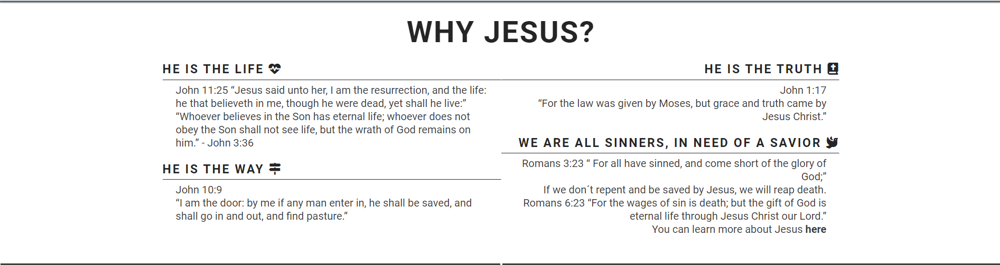|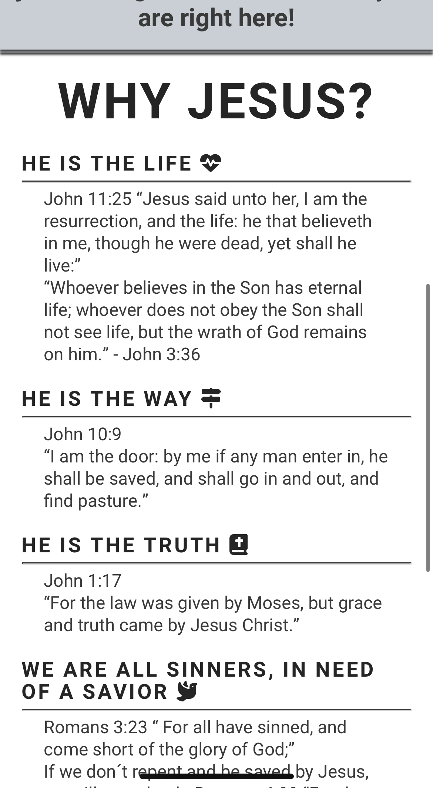|

### **Service Time Section**

The "Service-time" section is showing visitors date, time and location for a specific event. The section's design prioritizes user-friendliness, featuring clear title (event) and appropriate icons.
| Desktop | Mobile |
|-------------------|-------------------|
||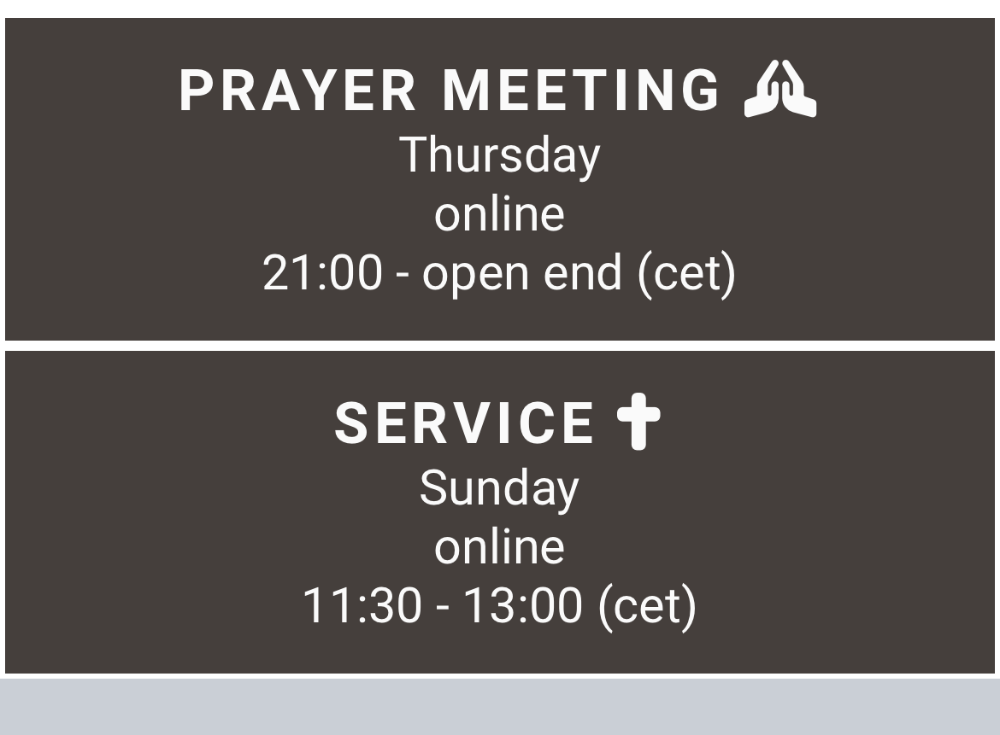|

### **Footer Section**

The "Footer" section, you'll find ways to stay connected with the church through social media channels, where you can join a prayer meeting, share testimonies, and stay updated on the latest news and events. Also it is indicated that the website is created for educational purposes.
| Desktop | Mobile |
|-------------------|-------------------|
|||

### **About Page**

Visitors can learn more about the Way, the Truth & the Life Church its beliefs, mission and vision. In the beginning there is a hero section with the title of the page and at the end users can read about who the pastor of the church is. 
| Desktop | Mobile |
|-------------------|-------------------|
|||

### **Prayer Request Page**

The Prayer Request page 
| Desktop | Mobile |
|-------------------|-------------------|
|||

### **Thank You for Prayer Request Page**

The Thank you for Prayer Request page is a thank-you to users who submitted a prayer request, complete with a suitable Bible verse, a button to return to the homepage, and a background image showing an open bible. It's an encouraging part of our website dedicated to those needing prayers.
| Desktop | Mobile |
|-------------------|-------------------|
|||

## Naming Convention

The naming convention of this project uses name related to the website content such as in the example below. Showing the argument section using the name of jesus such as immanuel or blessings (as a result of knowing jesus).
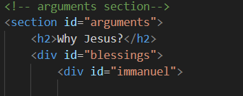

## Testing

Responsiveness has been checked and adjusted in Chrome Dev Tools and the site has been viewed on mobiles and desktop without issues and the following browsers:

- Chrome

- Safari

### **HTML Validation (Homepage)**

All HTML code has been run through the [W3C - HTML](https://validator.w3.org/) validator. Results can be found below.
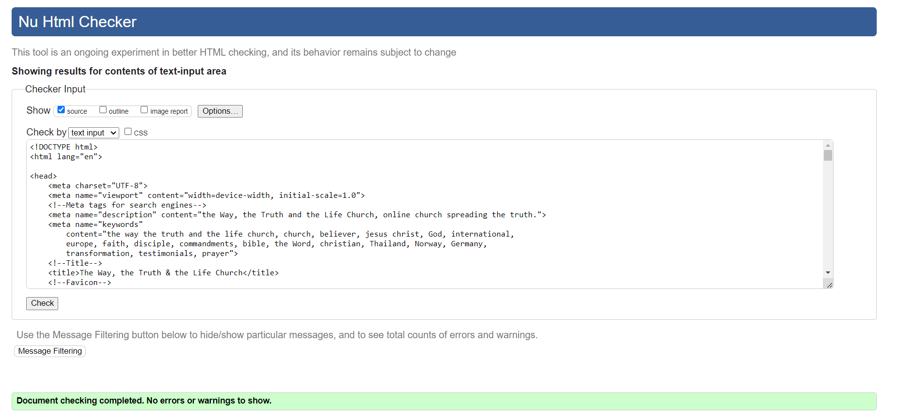

### **HTML Validation (Thank You for Prayer Request Page)**

All HTML code has been run through the [W3C - HTML](https://validator.w3.org/) validator. Results can be found below.
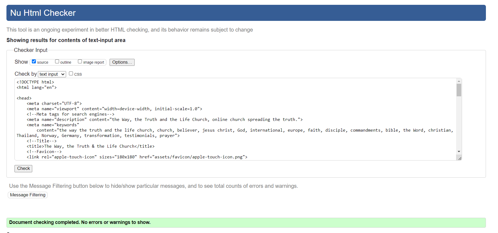

### **CSS Validation (Homepage)**

All CSS code has been run through the [W3C - CSS](https://jigsaw.w3.org/css-validator/) validator. Results can be found below.
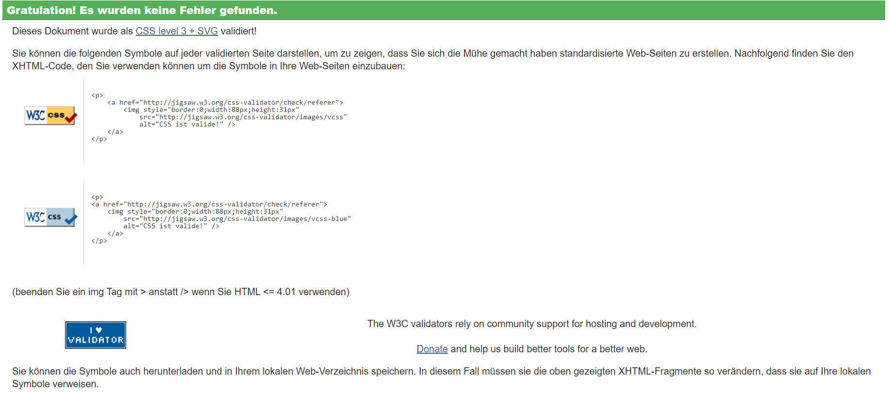

### **CSS Validation (Thank You for Prayer Request Page)**

All CSS code has been run through the [W3C - CSS](https://jigsaw.w3.org/css-validator/) validator. Results can be found below.
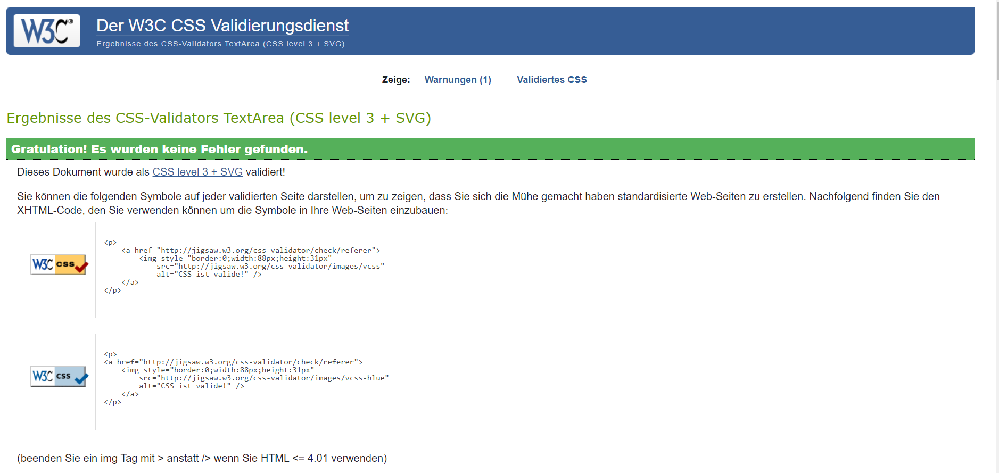

### **Google Lighthouse (Homepage)**

The lighthouse score results can be found below.

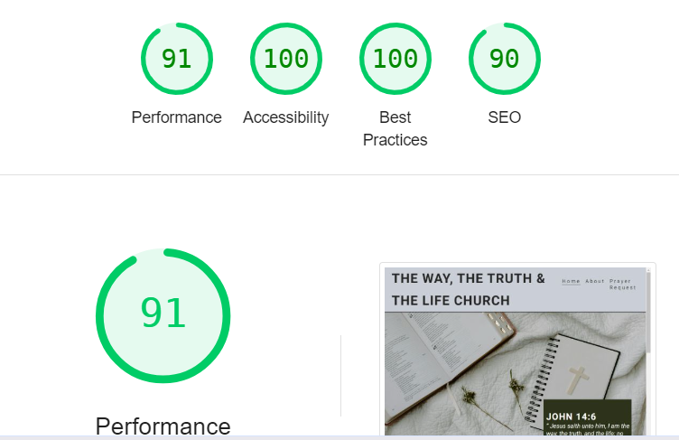

### **Google Lighthouse (Thank You for Prayer Request page)**

The lighthouse score results can be found below.

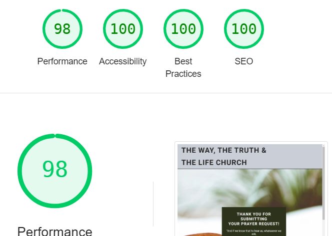

### **WAVE Accessibility Evaluation (Homepage)**

The WAVE accessibility evaluation tool results can be found below.

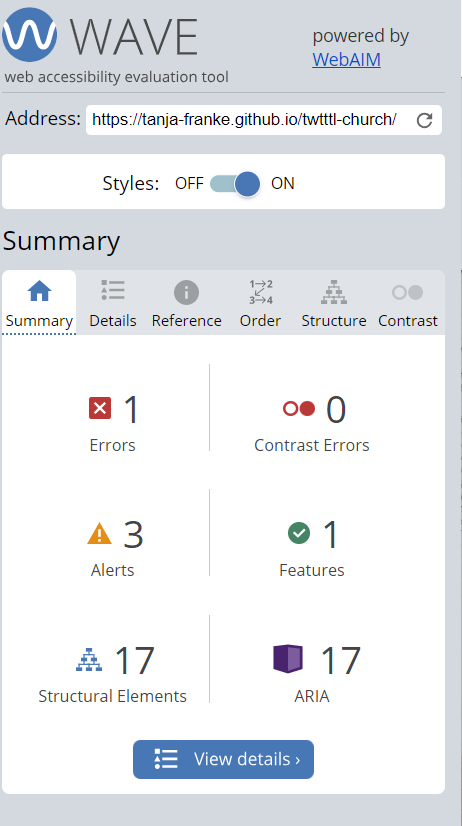

### **WAVE Accessibility Evaluation (Thank You for Prayer Request Page)**

The WAVE accessibility evaluation tool results can be found below.

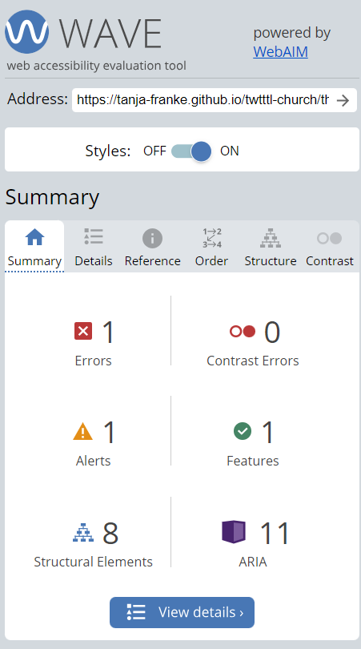

### **Manual Testing**

| Features                   | Expected Outcome                                                                                                         | Test Performed                                                                      | Results                                                          | Pass/Fail |
| -------------------------- | ------------------------------------------------------------------------------------------------------------------------ | ----------------------------------------------------------------------------------- | ---------------------------------------------------------------- | --------- |
| **Navbar**                 |
| The Way, the Truth & the Life Church                 | When clicked, the page should scroll up to the top of the page                                                           | Clicked "The Way, the Truth & the Life Church" in the Navbar                                                   | Page scrolled up to the top of the page  or return to landing page                        | Pass      |

| Contact                    | When clicked, the page should scroll down to the Footer                                                                  | Clicked "Contact" in the Navbar                                                     | Page scrolled down to the Footer                                 | Pass      |
| Menu Icon (Mobile Version) | When clicked, the navbar menu should be displayed                                                                        | Clicked Menu Icon (Hamburger) in the Navbar in the mobile version                   | Navbar menu was displayed                                        | Pass      |
| Menu Icon (Mobile Version) | If the Navbar menu is open, when clicked, the navbar menu should close                                                   | Clicked Menu Icon (Hamburger) while the navbar menu was open, in the mobile version | Navbar menu was closed                                           | Pass      |

| **Footer**                 |
| Instagram Icon             | When clicked, the instagram website should open in a new browser tab                                                     | Clicked Instagram icon in the Footer                                                | A new browser tab was opened with Instagram web page             | Pass      |
| X / Twitter Icon           | When clicked, the X / Twitter website should open in a new browser tab                                                   | Clicked X icon in the Footer                                                        | A new browser tab was opened with X / Twitter web page           | Pass      |
| Facebook Icon              | When clicked, the Facebook website should open in a new browser tab                                                      | Clicked Facebook icon in the Footer                                                 | A new browser tab was opened with Facebook web page              | Pass      |

| LinkedIn icon          | When clicked, should open the developer linkedin page in a new browser tab                                               | Clicked icon in the Footer                                                | A new browser tab was opened with the developer linkedin profile | Pass      |
| **Prayer Request Page**        |
| Prayer Request Form               | When an invalid email format is entered, a warning message should be displayed                                           | Typed "user@" in the email input in the Footer                                      | A warning message was displayed                                  | Pass      |
| Send Prayer Button           | When entering a valid email and clicking in the "Send Prayer" button, the user should be redirected to the thank you for prayer request page | Typed "user@gmail.com" in the email input in the Footer                             | User was directed to the thank you for prayer request page                         | Pass      |
### **Bugs**

### 1. Incorrect File Paths for favicons

**Description:**  
When the project was first deployed, the links to the CSS files and images were not working. This issue did not occur in the local development environment but only after deployment.

 Click to see images 

### **Test Final Review**

The testing procedures have been executed, meeting all specified criteria. Results have been thoroughly documented, and any identified issues have been addressed. Post-testing, the website has been confirmed to be fully functional and accessible.

## Tech Stack

This website is developed using the following technologies:

**HTML**: For structuring the content and layout of the web pages.

**CSS**: For styling the website and making it visually appealing.

## Tools Used

This website is developed using the following tools:

**GitHub**: Used for version control and code storage. GitHub allows for collaborative development, issue tracking, and code review, ensuring a smooth workflow and version management.

**VS Code**: Integrated Development Environment (IDE) used to write, edit, and debug code. VS Code supports numerous extensions that enhance productivity, such as Git integration, syntax highlighting, and linting tools.

**Google DevTools**: A set of web developer tools built directly into the Google Chrome browser. Google DevTools provides features for debugging, editing CSS and HTML on the fly, and analyzing website performance.

**Google Fonts**: A library of over a thousand free and open-source font families. Google Fonts ensures consistent and aesthetically pleasing typography across different browsers and devices.

**Font Awesome**: A toolkit for using icons and social logos on your website. Font Awesome icons are vector-based, which makes them highly customizable in terms of size, color, and positioning.

**Mockflow**: A wireframing tool used to create mockups. Mockflow helps in quickly visualizing the structure and layout of web pages before moving on to high-fidelity design.

**W3C Markup Validation Service**: A tool provided by the World Wide Web Consortium (W3C) to validate HTML and XHTML documents. This service checks for errors in the markup to ensure compliance with web standards.

**W3C CSS Validation Service**: A tool provided by W3C to validate CSS code. It helps in identifying errors and potential issues in the stylesheet, ensuring it adheres to CSS standards.

**WAVE Accessibility**: A web accessibility evaluation tool. WAVE helps in identifying accessibility issues on web pages, ensuring they are accessible to users with disabilities.

**Google Lighthouse**: An open-source, automated tool for improving the quality of web pages. Lighthouse audits performance, accessibility, SEO, and other best practices, providing insights and recommendations for improvement.

**Favicon.io**: A tool that simplifies the creation of website favicons, allowing users to easily generate icons that represent their brand across different platforms and devices.

Each of these tools plays a crucial role in the development, deployment, and maintenance of the website, contributing to its overall quality and user experience.

## Deployment

This website is deployed using Git pages.

### Deployment Steps

1. **Log in to Git Hub:** Navigate to the [Github website](https://github.com/) and log in to your account.

2. **In the Github page go to your repository:** Once logged in, the dashboard will appear and on the lefthand side there are your top repository.

3. **Select Repository:** Select the repository for website to be deployed, in this case, "twtttl-church"

4. 

5. **Configure Settings:** 
6. **Deploy Site:** O
7. **Live Site:** After the deployment process is complete, GitHub will provide you with a unique URL for your live site. You can access your live site by visiting this URL.[Live website](https://tanja-franke.github.io/twtttl-church/)

## Credits

No external code sources were used to develop this website.

All images used in this project are credited to their respective authors. You can find the author information by hovering over each image, where the title attribute displays the credit.

Credits to: shutterstock.com @malee2, @Veera, Unsplash - @ivanlyah, Pinterest - @devonresale, @artiepaws, @estherbarcomb, @ruto_boomeowbooo, @anechka_mardar, stock.adobe.com - @aylabaha, @veera, @annaav, Getty Images/Canva Pro, Instagram - @devonrexsharing, TikTok - @user13663e.

## Acknowledgements

A special thank you to my mentor [Harry Dhillon](https://www.linkedin.com/in/harry-dhillon-299b321b3/) from [Code Institute](https://codeinstitute.net/ie/), for your advice, feedback and reviewing my work!

### Features Left to Implement

### Unfixed Bugs

 

## Deployment

This section should describe the process you went through to deploy the project to a hosting platform (e.g. GitHub) 

- The site was deployed to GitHub pages. The steps to deploy are as follows: 
  - In the GitHub repository, navigate to the Settings tab 
  - From the source section drop-down menu, select the Master Branch
  - Once the master branch has been selected, the page will be automatically refreshed with a detailed ribbon display to indicate the successful deployment. 

The live link can be found here - 

## Credits 

### Content 

- The text for the Home page was taken from The Holy Bible
- Instructions on how to implement form validation on the Prayer Request page was taken from Coders Coffeehouse course content from the code institute.
- The icons in the footer were taken from [Font Awesome](https://fontawesome.com/)

### Media

- The photos used on the home and sign up page are from This Open Source site [pexels.com](https://www.pexels.com/de-de/collections/christianity-bk1scvv/)

