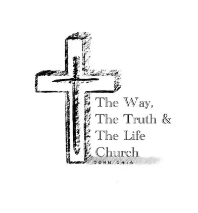

#
# The Way, the Truth & the Life Church 

## Description

Learn more about Jesus, the Word of God and get to know the Way, the Truth & the Life Church.

You can visit the live website [here!](https://tanja-franke.github.io/twtttl-church/)

## **User Experience**
## UX

This project was initiated to give the Way, the Truth & the Life Church an online presence. The website aimes to provide the visitors with information about the church and anything related to the Christian faith.

### **Project Goals**

1. **Educational Resource:** To offer comprehensive knowledge about the Christian faith for non-believers as well as believers.

2. **Community Engagement:** To foster a vibrant online community where believers can connect, share experiences, and engage with each other by joining online services or prayer meetings as well as by sending praying requests.

3. **User-Friendly Experience:** To create a visually appealing and easy-to-navigate website accessible to users of all backgrounds.
### User goals

- Retrieve information about the church in terms of who they are, what they believe in.

- Find Information about event times and locations.
- Learn more about Jesus.
- Send a prayer request.

### User expectations

- Website is easy to access from any devices

- Website works on all devices in terms of appearance

- User-friendly interface where the user can find what they are looking effortlessly

- Links and features that work the way they should

- Simple layout

- broad understanding of the Christian faith and of the church as part of this faith.

### User stories

#### User

- As a new believer I want a simple, beginner-friendly interface that allows me to explore the church and learn about Jesus without frustration.

- As a believer browsing for a new church, I want to learn more about the church and what their values are and eventually who the leader is.

- As a member of the church, I want to know the time and location of a specific event and might need a prayer.

#### Site owner

- As the operator of the site I want to be able to represent the church as they want to be acknowledged

- As the site owner I want to win more souls for the Kingdom of God

- As the site owner I want to lay out information about the church and key facts about Jesus

- As the site operator I want to be able continuously improve the website and update information

[Back to top](#)

### **Target Audience**

Our target audience includes non-believers, new-believers as well as mature-believers and among them members of the church. Basically, anyone interested in the Christian faith and looking for a church they want to join.
[Back to top](#)
## **Design**

### **Colours**

### **Typography**

- All icons were sourced though [Font Awesome](https://fontawesome.com/)
- All fonts were sourced through [Google Fonts](https://fonts.google.com/)
- [Roboto](https://fonts.google.com/specimen/Roboto)

### **Wireframe and Prototype**

### [Mockflow](https://mockflow.com//) wireframe:

 Open for initial wireframe -landing page 

 Open for initial wireframe -About page 

 Open for initial wireframe -Prayer Request page 

[Back to top](#)

## Features

### **Meta Tags and Optimization**

The `<head>` section of the Way, the Truth & the Life Church website includes essential meta tags for SEO and social media sharing. The meta description provides a summary for search engines, while the keywords tag helps search engines understand the site content. The Open Graph title and image tags set the title and image for social media sharing, ensuring the content is attractive and informative when shared on platforms like Facebook and Twitter.

### **Navbar**

The website's navbar is like a map for users to navigate through the website . It should be designed for users to find what they are looking for without any effort. This website´s navbar provides intuitive access to key sections of the website, including Home, About, Prayer Request.
| Desktop | Mobile |
|-------------------|-------------------|
|||

### **Hero Section**

The "Hero" section of the Way, the Truth and the Life Church website features a prominent hero-image and a textbox. It includes a visually engaging image of the Bible and a cross, which immediately gives visitors a hint that it is a Christian website. This section supports the name of the church by the bible verse indicated in the textbox.
| Desktop | Mobile |
|-------------------|-------------------|
|||

### **Chosen Section**

The "Chosen" section of the Way, the Truth & the Life Church website provides a call for action and information about what users will find on this website.
| Desktop | Mobile |
|-------------------|-------------------|
|||

### **Arguments Section**

The "Arguments" section is built to provide visitors with an overall insight of why they should believe in Jesus. Reasons are divided into four sections proving the belonging Bible-verses to support the arguments.
| Desktop | Mobile |
|-------------------|-------------------|
|||

### **Service Time Section**

The "Service-time" section is showing visitors date, time, and location for a specific event. The section's design prioritizes user-friendliness, featuring clear title (event) and appropriate icons.
| Desktop | Mobile |
|-------------------|-------------------|
|||

### **Footer Section**

The "Footer" section, you will find ways to stay connected with the church through social media channels, where you can join a prayer meeting, share testimonies, and stay updated on the latest news and events. Also, it is indicated that the website is created for educational purposes.
| Desktop | Mobile |
|-------------------|-------------------|
|||

### **About Page**

Visitors can learn more about the Way, the Truth & the Life Church its beliefs, mission, and vision. In the beginning there is a hero section with the title of the page and at the end users can read about who the pastor of the church is. 
| Desktop | Mobile |
|-------------------|-------------------|
|||
### **Church Section**
The "church" section is highlighting the key facts about the church. 
| Desktop | Mobile |
|-------------------|-------------------|
|||

### **Beliefs, Mission, and Vision Section**
The "Beliefs, Mission and Vision" section is displaying the values of the church and what their mission and vision are.
| Desktop | Mobile |
|-------------------|-------------------|
|||

### **Pastor Section**
The "Pastor" section introduces the pastor and her path into faith.
| Desktop | Mobile |
|-------------------|-------------------|
|||

### **Prayer Request Page**

The Prayer Request page 
| Desktop | Mobile |
|-------------------|-------------------|
|||

### **Thank You for Prayer Request Page**

The Thank you for Prayer Request page is a thank-you to users who submitted a prayer request, complete with a suitable Bible verse, a button to return to the homepage, and a background image showing an open bible. It is an encouraging part of this website dedicated to those needing prayers.
| Desktop | Mobile |
|-------------------|-------------------|
|||

[Back to top](#)

## Naming Convention

The naming convention of this project uses name related to the website content such as in the example below. Showing the argument section using the name of Jesus and Immanuel or blessings (because of knowing Jesus).

[Back to top](#)
## Testing

Responsiveness has been checked and adjusted in Chrome Dev Tools and the site has been viewed on mobiles and desktop without issues and the following browsers:

- Chrome

- Safari

### **HTML Validation (Homepage)**

All HTML code has been run through the [W3C - HTML](https://validator.w3.org/) validator. Results can be found below.

### **HTML Validation (Thank You for Prayer Request Page)**

All HTML code has been run through the [W3C - HTML](https://validator.w3.org/) validator. Results can be found below.

### **CSS Validation (Homepage)**

All CSS code has been run through the [W3C - CSS](https://jigsaw.w3.org/css-validator/) validator. Results can be found below.

### **CSS Validation (Thank You for Prayer Request Page)**

All CSS code has been run through the [W3C - CSS](https://jigsaw.w3.org/css-validator/) validator. Results can be found below.

### **Google Lighthouse (Homepage)**

The lighthouse score results can be found below.

### **Google Lighthouse (Thank You for Prayer Request page)**

The lighthouse score results can be found below.

### **WAVE Accessibility Evaluation (Homepage)**

The WAVE accessibility evaluation tool results can be found below.

### **WAVE Accessibility Evaluation (Thank You for Prayer Request Page)**

The WAVE accessibility evaluation tool results can be found below.

### **Manual Testing**

| Features                   | Expected Outcome                                                                                                         | Test Performed                                                                      | Results                                                          | Pass/Fail |
| -------------------------- | ------------------------------------------------------------------------------------------------------------------------ | ----------------------------------------------------------------------------------- | ---------------------------------------------------------------- | --------- |
| **Navbar**                 |
| The Way, The Truth & The Life Church               | When clicked, should redirected the user to the Home page                                                         | Clicked "The Way, The Truth & The Life Church" in the Navbar                                                   | Return to Homepage                          | :white_check_mark:
     |
| Home                  | When clicked,  should redirected the user to the Home page                                                                                                          | Clicked "Home" in the Navbar                                                     | Return to Homepage | :white_check_mark:      |
| About                    | When clicked, the user will be directed to the About page                                                    | Clicked "About" in the Navbar                                                      | User is navigated to the About page                  | :white_check_mark:      |
| Prayer Request                       | When clicked, the user will be directed to Prayer Request page| Clicked "Prayer Request" in the Navbar                                                        | User is navigated to the Prayer Request page| :white_check_mark:      |
| Hamburger Bar (Mobile Version) | When clicked, the navbar menu should be displayed                                                                        | Clicked on Hamburger Bar in the Navbar in the mobile version                   | Navbar menu was displayed                                        | :white_check_mark:      |
| Hamburger Bar (Mobile Version) | If the Navbar menu is open, when clicked, the navbar menu should close                                                   | Clicked hamburger bar while the navbar menu was open, in the mobile version | Navbar menu was closed                                           | :white_check_mark:      |
| **Prayer Request**  |
| Prayer Request Form email section              | When an invalid email format is entered, a warning message should be displayed                                           | Typed "user@" in the email input in the Footer                                      | A warning message was displayed                                  | :white_check_mark:      |
| Send Prayer Button           | When entering all the required fields and clicking in the "Send Prayer" button, the user should be redirected to the “Thank You for Prayer Request” page | Filled "every field” correctly in the form and clicked the “Send Prayer” button                           | User was directed to the subscriber page                         | :white_check_mark:      |
| Input fields| When left out, a warning message should be shown | left one field empty and clicked the “Send Prayer” button                                               | A warning message was displayed                  | :white_check_mark:      |
| **Footer**                 |
| Instagram Icon             | When clicked, the Instagram website should open in a new browser tab                                                     | Clicked “Instagram Icon” in the Footer                                                | A new browser tab was opened with Instagram web page             | :white_check_mark:      |
| Youtube Icon           | When clicked, the Youtube website should open in a new browser tab                                                   | Clicked “Youtube icon” in the Footer                                                        | A new browser tab was opened with X / Twitter web page           | :white_check_mark:      |
| Facebook Icon              | When clicked, the Facebook website should open in a new browser tab                                                      | Clicked “Facebook Icon” in the Footer                                                 | A new browser tab was opened with Facebook web page              | :white_check_mark:      |
| GitHub Icon              | When clicked, should open the developer GitHub page in a new browser tab                                               | Clicked “GitHub Icon” in the Footer                                                 | A new browser tab was opened with the developer´s GitHub profile      | :white_check_mark:      |
| LinkedIn Icon        | When clicked, should open the developer´s LinkedIn page in a new browser tab                                               | Clicked "LinkedIn Icon" in the Footer                                                | A new browser tab was opened with the developer´s GitHub profile | :white_check_mark:      |
| **Thank You for Prayer Request Page**        |
| Return Button                | When clicked, should be redirected to the Homepage                                                                       | Clicked Home button in the Thank You for Prayer Request Page                                          | Redirected to the Homepage                                       | :white_check_mark:      |
### **Bugs**

### 1. Incorrect File Paths for favicons

**Description:**  
When the project was first deployed, the favicons don´t show anymore. This issue did not occur in the local development environment but only after deployment.
**Issue**
The suggested embedded code suggested by favicon.io was used. 
**Solution**
Inserted the right path to favicons line.

 Click to see images 

### 2. Empty Form Label identified by the Wave Accessibility

**Description:**  
When running Wave on the website an error of ‘empty form label’ comes up on the header of all pages.
**Issue**
There are no association of label to the hamburger button meaning no accessible name to the hamburger button
**Solution**
Was to give the label an attribute of aria-label.

 Click to see images 

### **Test Final Review**

The testing procedures have been executed, meeting all specified criteria. Results have been thoroughly documented, and any identified issues have been addressed. Post-testing, the website has been confirmed to be fully functional and accessible.
[Back to top](#)
## Tech Stack

This website is developed using the following technologies:

**HTML**: For the structure and the layout of the website.

**CSS**: For styling the structure created with html such as color, sizes, and fonts.

## Tools Used

This website is developed using the following tools:

**GitHub**: Used for version control and code storage. GitHub allows for collaborative development, issue tracking, and code review, ensuring a smooth workflow and version management.

**Gitpod**: Cloud-based workspace environment where developers can code, write and debug without any local setup.

**Google DevTools**: A set of web developer tools built directly into the Google Chrome browser. Google DevTools provides features for debugging, editing CSS and HTML on the fly, and analyzing website performance.

**Google Fonts**: A library of over a thousand free and open-source font families. Google Fonts ensures consistent and aesthetically pleasing typography across different browsers and devices.

**Font Awesome**: A toolkit for using icons and social logos on your website. Font Awesome icons are vector-based, which makes them highly customizable in terms of size, color, and positioning.

**Mockflow**: A wireframing tool used to create mockups. Mockflow helps in quickly visualizing the structure and layout of web pages before moving on to high-fidelity design.

**W3C Markup Validation Service**: A tool provided by the World Wide Web Consortium (W3C) to validate HTML and XHTML documents. This service checks for errors in the markup to ensure compliance with web standards.

**W3C CSS Validation Service**: A tool provided by W3C to validate CSS code. It helps in identifying errors and potential issues in the stylesheet, ensuring it adheres to CSS standards.

**WAVE Accessibility**: A web accessibility evaluation tool. WAVE helps in identifying accessibility issues on web pages, ensuring they are accessible to users with disabilities.

**Google Lighthouse**: An open-source, automated tool for improving the quality of web pages. Lighthouse audits performance, accessibility, SEO, and other best practices, providing insights and recommendations for improvement.

**Favicon.io**: A tool that simplifies the creation of website favicons, allowing users to easily generate icons that represent their brand across different platforms and devices.

Each of these tools plays a crucial role in the development, deployment, and maintenance of the website, contributing to its overall quality and user experience.
[Back to top](#)
## Deployment

This website is deployed using Git pages.

### Deployment Steps

1. **Log in to Git Hub:** Navigate to the [Github website](https://github.com/) and log in to your account.

2. **Go to your repository:** Once logged in, the dashboard will appear and on the lefthand side there are your top repository.
3. **Select Repository:** Select the repository for website to be deployed, in this case, "twtttl-church"
4. **Go to the Settings tab:** Click on the setting tab and a new interface will open
5. **Select Pages:** On the left-hand side you will find Pages nested in the Code and automation section, 
6. **Configure Settings:** Source needs to be set to `Deploy from Branch’ the Main branch should be selected and the folder needs to be set to /root
7. ** Deploy website:** By clicking Save under the branch, your website will be deployed
8.**Refresh Repository:** Return to the Code tab. After a few minutes you can refresh your repository.
9.**View the deployment:** Go to ´github-pages’ on the right-hand side and see your deployment.
10. **Live Site:** After the deployment process is complete, GitHub will provide you with a unique URL consisting of your username and the name of your project for your live site. 
You can access my live site by visiting this URL.[Live website](https://tanja-franke.github.io/twtttl-church/)

## Credits
The full-screen hero image code came originally from the Code institute´s  ‘Love Running’ project The same goes for the keyframe as well as the footer code. However, none of these remained in its original form because they have been modified and styled differently to accompany the appearance of the website.

All images used in this project are credited to their respective authors. You can find the author information below.
Credits to: pexels.com @Tara_Winstead, @Rahul_Pandit
	Unsplash.com @Ben_White

## Acknowledgements

A special thank you to my mentor [Harry Dhillon](https://www.linkedin.com/in/harry-dhillon-299b321b3/) from [Code Institute](https://codeinstitute.net/ie/), for your advice, feedback and reviewing my work!
My CI facilitator Kamil Wojciechowski and my peers from 5p for helping and giving me feedback and reviewing my work!
The Stack Overflow community for providing answers to specific coding questions.
Finally, God and my church community for allowing me to create this website for educational purposes and praying for me to have the right support and to finish this project.
[Back to top](#)
